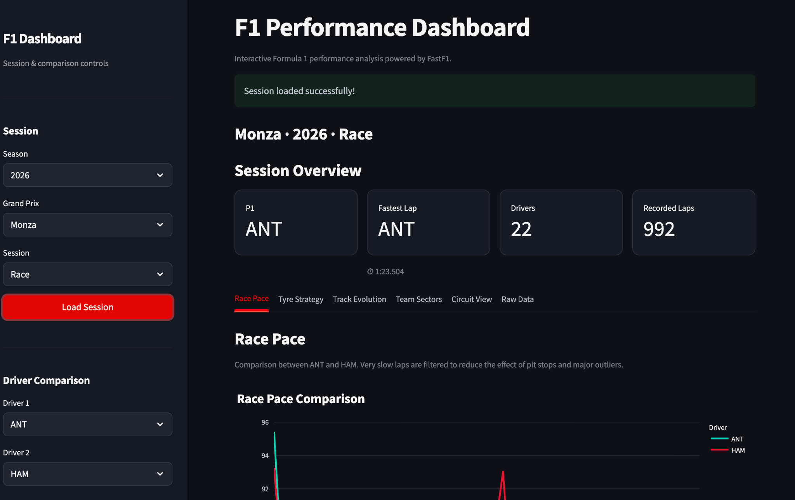

# Formula 1 Data Analysis Portfolio

A collection of Formula 1 data analysis projects developed in Python using real motorsport data from the FastF1 library.

This repository explores different aspects of Formula 1 performance through data analysis, visualization, telemetry and predictive modelling.



## Projects

### 1. F1 Performance Dashboard

Interactive Streamlit dashboard for exploring Formula 1 session data.

Main features:

- Driver race pace comparison
- Tyre strategy visualization
- Estimated tyre degradation
- Session performance evolution
- Team sector analysis
- Circuit speed map
- Circuit sector map
- Raw FastF1 data exploration

**Technologies:** Python, FastF1, Pandas, NumPy, Plotly, Streamlit

[View Project](projects/01_performance_dashboard)

---

### 2. 2025 vs 2026 Braking & Corner Approach Analysis
*Planned*

### 3. Regulation Era Performance Evolution
*Planned*

### 4. Race Outcome Predictor
*Planned*

### 5. Max vs 100 — Monte Carlo Simulator
*Planned*

## Exploratory Notebooks

The `notebooks/` directory contains exploratory analyses developed while learning how to work with FastF1 data.

These notebooks document the experimentation process that preceded the development of the final projects.

## Repository Structure

```text
F1_Data_Analysis/
├── assets/
├── data/
├── notebooks/
├── projects/
│   └── 01_performance_dashboard/
├── .gitignore
├── README.md
└── requirements.txt

## Getting Started

### 1. Clone the repository

```bash
git clone https://github.com/SaraBiavasco/F1_Data_Analysis.git
cd F1_Data_Analysis
```

### 2. Install dependencies

```bash
pip install -r requirements.txt
```

### 3. Launch the Performance Dashboard

```bash
streamlit run projects/01_performance_dashboard/app.py
```

The dashboard opens in your browser, where you can select a Formula 1 event, session and drivers to explore the available analyses.

**Note:** An internet connection is required to retrieve session data through FastF1. The first data request may take longer, while subsequent requests can benefit from local caching.