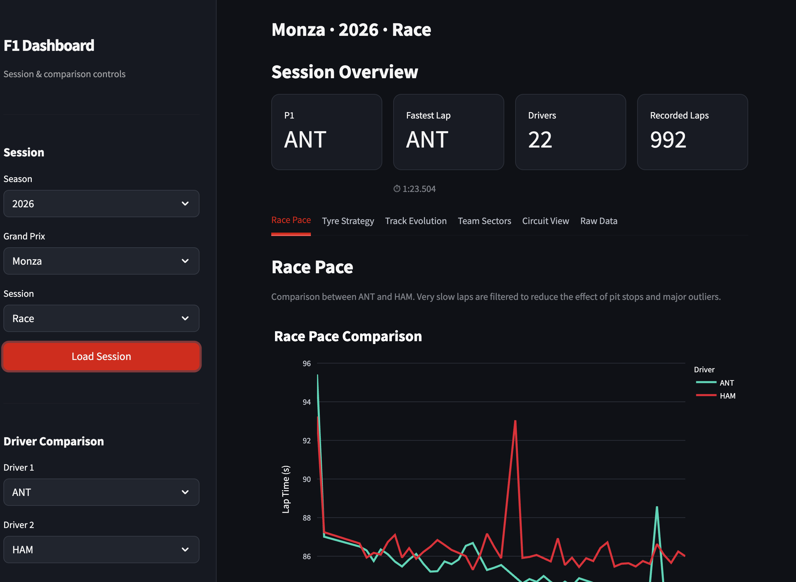
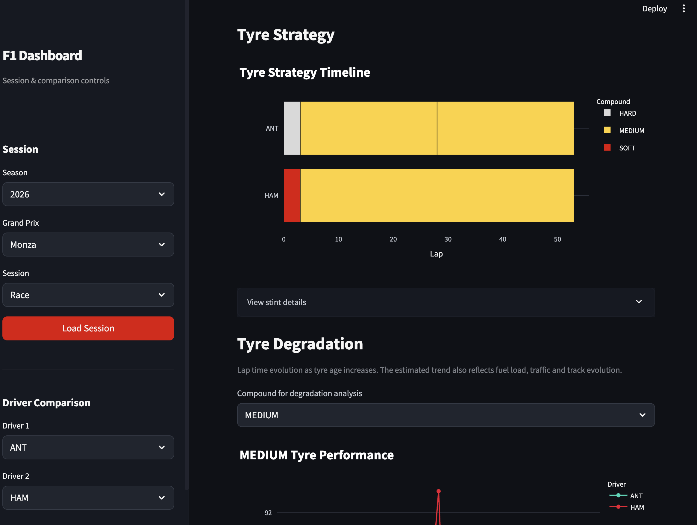
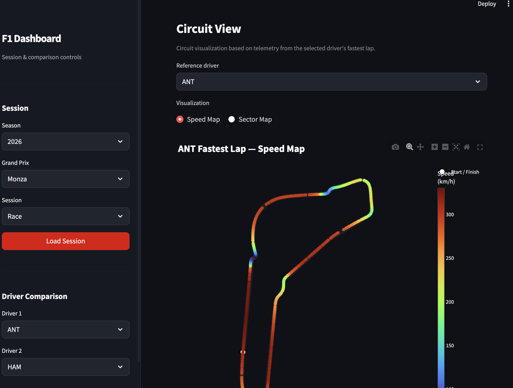

# F1 Performance Dashboard

An interactive Formula 1 performance analysis dashboard built with **Python, FastF1, Plotly, and Streamlit**.

## Project Overview

This project provides an interactive environment for exploring Formula 1 session data, including lap times, tyre strategies, driver performance, and circuit telemetry.

The dashboard transforms real motorsport data retrieved through the FastF1 library into interactive visualizations, allowing users to compare drivers, examine performance trends, and investigate different aspects of a racing session.

The main objective is to combine **data processing, exploratory analysis, and interactive visualization** into a single application.

## Screenshots

### Dashboard Overview


### Tyre Strategy Visualization


### Circuit Speed Map


## Features

The dashboard includes eight analytical sections:

1. **Driver Race Pace Comparison**, ompare drivers' lap times and performance differences throughout a session.
2. **Tyre Strategy Visualization**, Explore tyre compounds and stint sequences across drivers.
3. **Estimated Tyre Degradation**, Examine lap-time trends within tyre stints to estimate potential performance degradation.
4. **Session Performance Evolution**, Investigate how lap times evolve during a session.
5. **Team Sector Analysis**, Compare performance across the three circuit sectors.
6. **Circuit Speed Map**, Visualize speed variations around the circuit using car telemetry.
7. **Circuit Sector Map**, Explore the circuit layout divided into timing sectors.
8. **Raw FastF1 Data Exploration**, Inspect selected underlying session data directly.

## Technologies Used

- **Python** — Core programming language
- **FastF1** — Retrieval of Formula 1 timing, session, and telemetry data
- **Pandas** — Data manipulation and analysis
- **NumPy** — Numerical operations
- **Plotly** — Interactive data visualizations
- **Streamlit** — Interactive web application framework

## How to Run

### 1. Clone the repository

```bash
git clone https://github.com/SaraBiavasco/F1_Data_Analysis.git
cd F1_Data_Analysis
```

### 2. Install dependencies

```bash
pip install -r requirements.txt
```

### 3. Launch the dashboard

```bash
streamlit run projects/01_performance_dashboard/app.py
```

The application will open in your browser.
Select a Formula 1 event and session to explore the available performance analyses.

## Methodology & Limitations

The dashboard uses publicly accessible Formula 1 data retrieved through the FastF1 Python library.
Lap times, tyre compounds, sector times, and telemetry measurements are processed to generate interactive comparisons and visualizations.

Some analyses require additional interpretation:

- **Tyre degradation:** Lap-time trends within a stint are used as an approximation of potential tyre degradation. These estimates may also be influenced by fuel load, traffic, track conditions, and race events.
- **Driver comparisons:** Performance differences may depend on tyre compounds, session conditions, and differences in running programmes.
- **Telemetry:** GPS coordinates, speed measurements, and other telemetry data may be subject to sampling limitations and missing values.
- **Data availability:** Certain analyses may be unavailable for specific events or sessions depending on the data provided by FastF1.

The dashboard is intended for exploratory analysis rather than definitive performance evaluation.

## Author

**Sara Biavasco**
